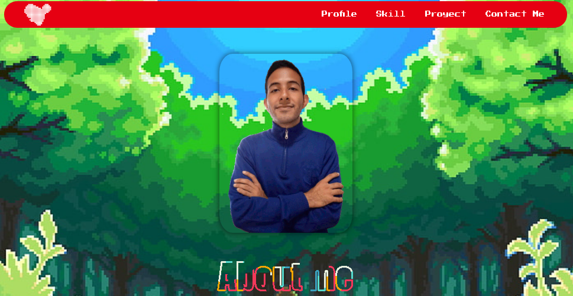

# Personal page

This project is about the development of my personal page, which complements my resume, and identifies my current skills and the projects I have done, as an endorsement of my experiences.

## Table of contents

- [Overview](#overview)
  - [The challenge](#the-challenge)
  - [Screenshot](#screenshot)
  - [Links](#links)
- [My process](#my-process)
  - [Built with](#built-with)
- [Author](#author)

## Overview

### The challenge

Users should be able to:

- View the optimal layout for the site depending on their device's screen size

### Screenshot

### Links

- Solution URL: [Add solution URL here](https://your-solution-url.com)
- Live Site URL: [Add live site URL here](https://your-live-site-url.com)

## My process

### Built with

- Semantic HTML5 markup
- CSS custom properties
- Flexbox
- CSS Grid
- Mobile-first workflow
- Bootstrap
- JavaScript
- jQuery

## Author

- Website - [Samuel Rodriguez](https://github.com/samuelpklm)
- Frontend Mentor - [@samuelpklm](https://www.frontendmentor.io/profile/samuelpklm)
- Email: samuelr76@gmail.com

